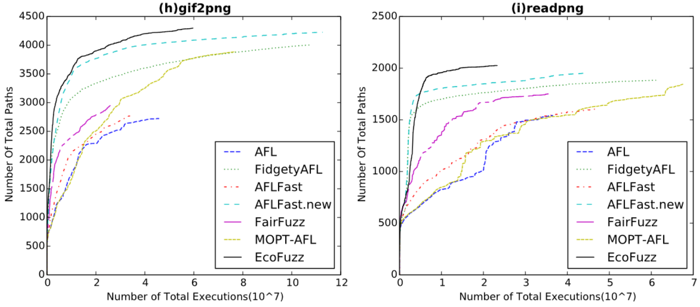
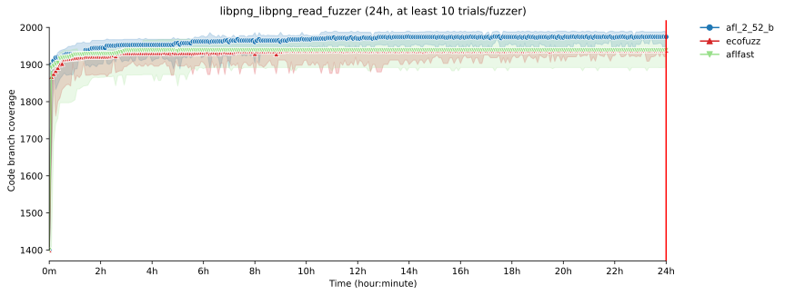
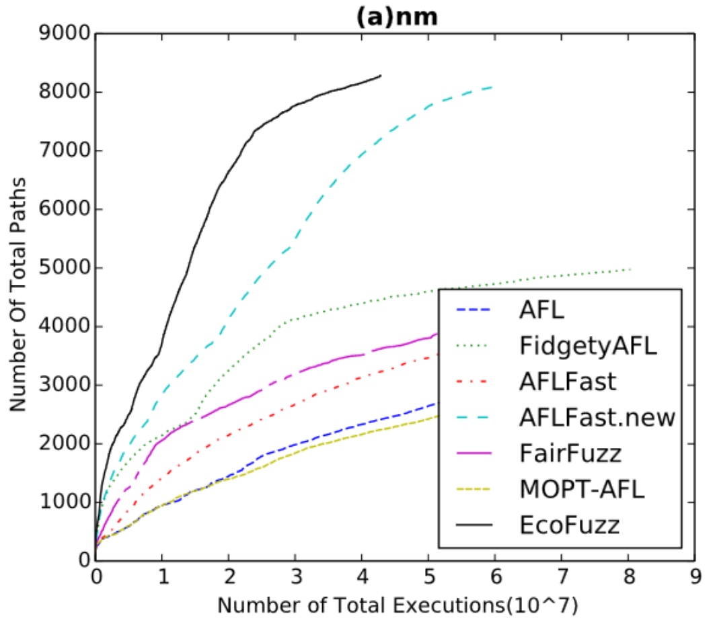
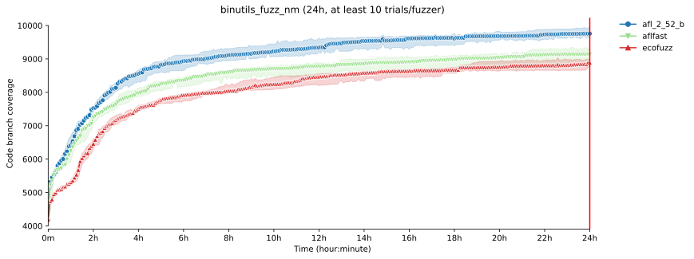
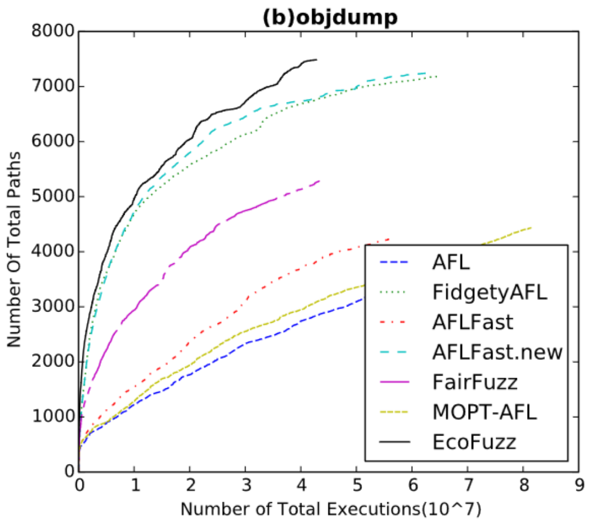
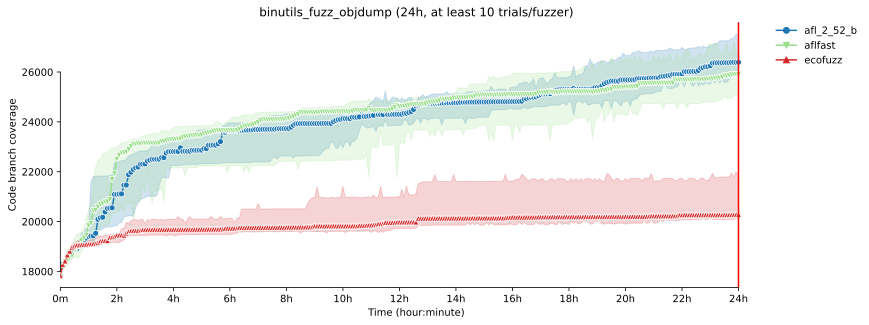

# Artifact Evaluation - EcoFuzz

This repository contains the FuzzBench setup and experiment configuration we use to reproduce the claims from [EcoFuzz (paper)](https://www.usenix.org/conference/usenixsecurity20/presentation/yue). The first part of this README will show our results provided via FuzzBench, and the second part will guide through the setup of our environment so that you can reproduce our results. You can also find all FuzzBench reports [here](fuzzbench_reports). Please clone the repository and open the `index.html` to view the report. 

## Conducted Experiments
After studying the paper and the artifact of EcoFuzz we noticed that the authors decided to use an atypical metric to showcase the performance of their fuzzer, without plotting a known metric such as coverage over time for all targets. Instead, they primarily plot *total paths discovered over executions*, which aligns with the goals of their paper but makes a comparison with other fuzzers challenging. Therefore, we set up FuzzBench to compare EcoFuzz to state-of-the-art fuzzers of that time and used in the paper.
For a fair experiment, we select three of the targets from the paper, where EcoFuzz excels (in terms of total paths found over executions) -- libpng, binutils_nm, and binutils_objdump. As competitors, we select AFL (version 2.52b) and AFLFast. Notably, we use the argument '-d' for all fuzzers to skip the deterministic state (this is in line with the paper; there, the AFL version without deterministic stage is referred to as FidgetyAFL), which is also the default in FuzzBench.

### Target: libpng
The EcoFuzz paper uses as a target *gif2png* and *readpng* that both leverage the *libpng* library. To reproduce this experiment, we chose the FuzzBench target *libpng_libpng_read_fuzzer*: even though this is different from *readpng*, we expect it to perform roughly equivalent as both test *libpng* in the end. The following image shows the coverage-over-time for the libpng target. All FuzzBench plots for this target can be found [here](images/libpng/). The full FuzzBench reports can be found [here](fuzzbench_reports/24h-ecofuzz-eval-libpng)

#### The plot from the paper:


#### The FuzzBench coverage plot:


----


### Target: nm
The second of our targets is *nm* from binutils. Since *nm* is not included in FuzzBench by default but tested by the [OSS-Fuzz project](https://github.com/google/oss-fuzz), we used the tooling provided by FuzzBench to integrate this target into FuzzBench. All FuzzBench plots for this target can be found [here](images/nm/). The full FuzzBench reports can be found [here](fuzzbench_reports/24h-ecofuzz-eval-nm).


#### The plot form the paper:


#### The FuzzBench coverage plot:


----


### Target: objdump
Our third target is *objdump*, again from binutils. Similar to *nm*, we use the tooling provided by FuzzBench to integrate this target into FuzzBench. All FuzzBench plots for this target can be found [here](images/objdump/). The full FuzzBench reports can be found [here](fuzzbench_reports/24h-ecofuzz-eval-objdump).


#### The plot form the paper:


#### The FuzzBench coverage plot:


----

## Interpretation of Results

As visible, the metric of total paths over executions does not translate to an improvement in terms of code coverage. On the contrary, EcoFuzz performs worse than AFL and AFLFast on all targets (but for libpng, where no statistically significant difference exists between AFLFast and EcoFuzz). Based on this, we recommend to include traditional metrics in a paper that allow for comparability with other works even when including new metrics.


## Setup
To reproduce our evaluation, follow these steps:

1. Clone this repository

   ```git clone https://github.com/fuzz-evaluator/EcoFuzz-eval.git```

2. Execute the `setup.sh` script
3. (Optional) Open a new tmux session

   ```tmux new -s ecofuzz-eval```

4. Execute the `run_fuzzbench_experiment.sh` script

**Important Note:** Running the `run_fuzzbench_experiment.sh` without further modifications requires many resources (**10 trials * 3 targets * 3 fuzzers = 90 docker containers spawned**). To reproduce the evaluation reliably, we advise executing only as many docker containers in parallel as you have physical CPU cores. Therefore, we recommend to comment out some of the benchmarks in the script (variable: `BENCHMARK`) and run them sequentially rather than in parallel. If doing so, you must also set a unique experiment name by altering the `EXP_ID` variable -- for examples check to code of the script.


The final results will be stored in `/opt/fuzzbench/fuzzbench-experiments/ecofuzz-eval`. The runtime of the experiment is set to 24h and 10 trials -- for statistical significance we recommend a minimum of 10 trials. However, the experiment storage, the number of trials and the runtime can be adjusted in the `config.yaml`.